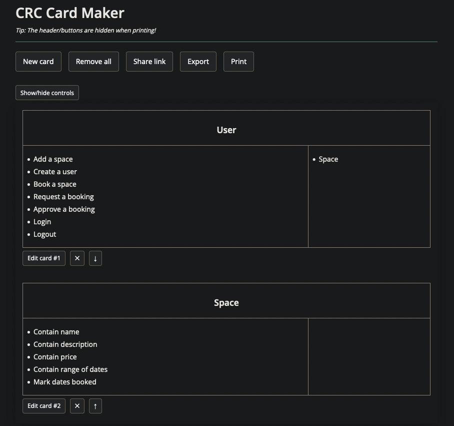
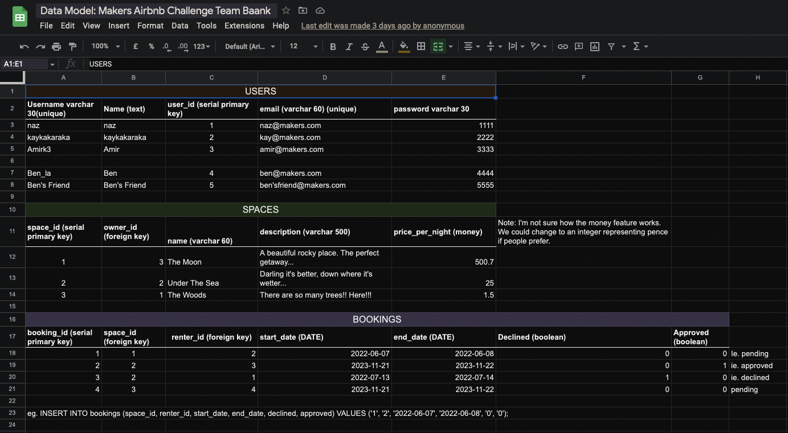
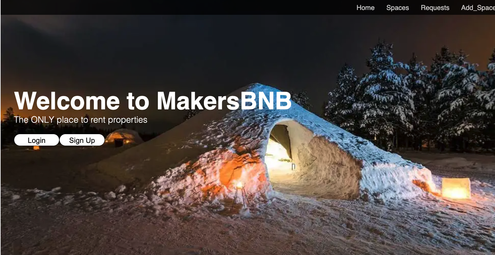
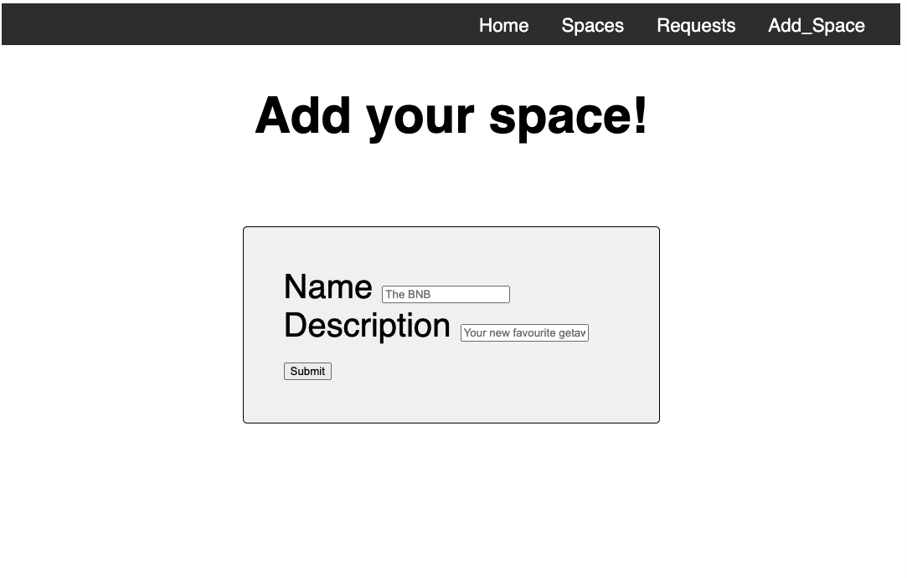
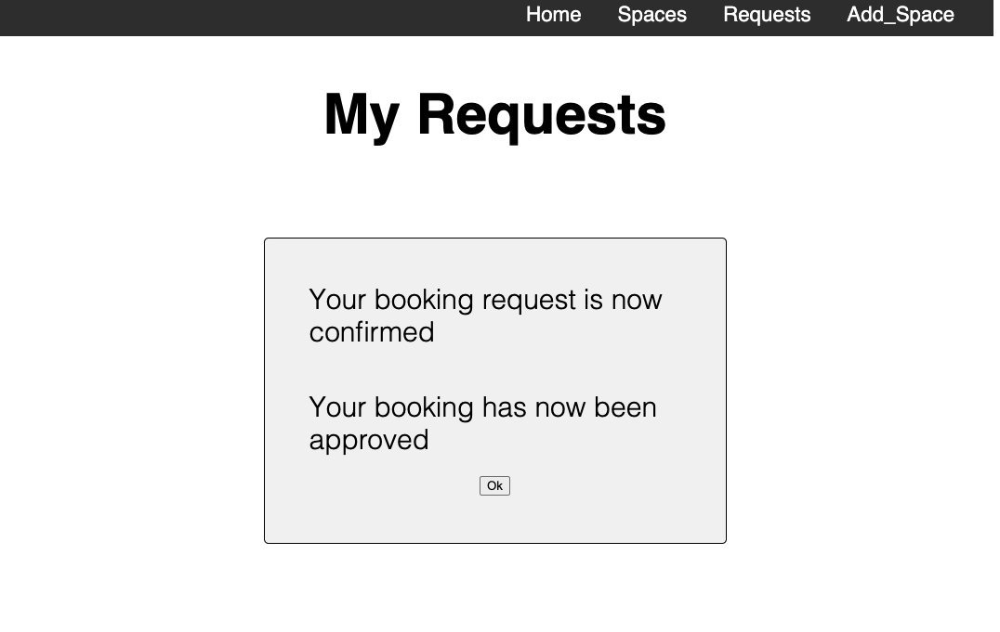

# Overview
- Building a web app that allows users to login to an accomodation rental site
- Users can add rental spaces, book rental spaces and reciveve confirmation of booking 

# Group Collabrators 

- [Ben](https://github.com/BenjaminNeustadt)
- [Kay](https://github.com/kaykakaraka)
- [Aisha](https://github.com/Aisha-Yusuff)
- [Amir](https://github.com/ak2022dev)
- [Naz H](https://github.com/nazhudha)

# Notes/updates during development

* MVP1 has been merged into main
* feature1_book_space has been merged into MVP1
* These are currently obsolete
* Created a new branch db_integration

# Headline specifications

* Any signed-up user can list a new space.
* Users can list multiple spaces.
* Users should be able to name their space, provide a short description of the space, and a price per night.
* Users should be able to offer a range of dates where their space is available.
* Any signed-up user can request to hire any space for one night, and this should be approved by the user     that owns that space.
* Nights for which a space has already been booked should not be available for users to book that space.
* Until a user has confirmed a booking request, that space can still be booked for that night.

# Design

## Class Responsibility Collaboration Cards

## Data Design

# Screen Shots
 

## ITERATIONS

Iteration 1: MPV - Spaces and dates are hardcoded
[...]
Iteration 4: current
Iteration 5: pending

### USER STORIES

* [MVP1]
`As a renter`\ 
`So that I can choose a place to stay` \ 
`I need to see available spaces with a name, description and price.`

TDD steps: 

- view_index_spec.rb in /features (connection test) [rspec] => PASSED

- return a space (description, name, price) [HARDCODED: single space, with fixed dates] to the index.erb file [capybara] => PASSED

-  Adapt the views and controller to take the data from the model and present them to the views in html, via controller. [capybara] => PASSED

- MVC refactor: move the list of spaces (be it one or more) away from the views and controller, and into the model (step 1) => PASSED
  and then database (step 2).[rspec] => PENDING

#### DATABASE SETUP

To Set Up the Database:
-----------------
Open the terminal. \
Enter `psql` \
Create the database using `CREATE DATABASE makers_bnb;` \
Connect to the database using `\c makers_bnb;` \
Run the commands in the db/migrations folder, in order.

To Set Up the Test Database:
-----------------
Open the terminal. \
Enter `psql` \
Create the test database using `CREATE DATABASE makers_bnb_test;` \
Connect to the database using `\c makers_bnb_test;` \
Run the commands in the db/migrations folder, in order.
